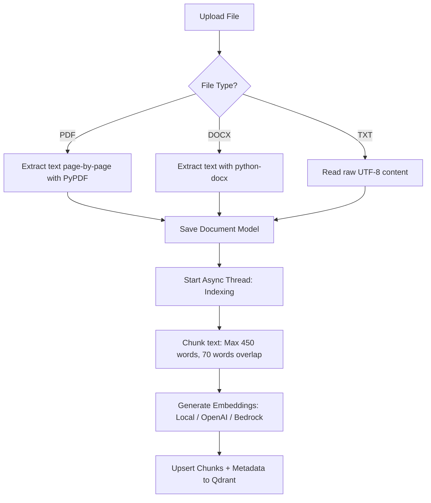
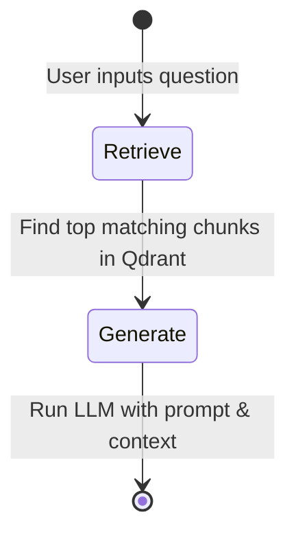

# Legal Document Query Backend

This is the backend service for the Legal Document Query application. It is built with **Django** and **Django REST Framework (DRF)**, utilizing a **Retrieval-Augmented Generation (RAG)** pipeline orchestrated by **LangGraph** to parse, index, search, and answer complex questions about legal documents.

---

## 🛠️ Technology Stack

The backend leverages a modern AI and web stack:

### 1. Core Framework & Web
* **Django (5.1.4)** & **Django REST Framework (3.15.2)**: Provides robust API structure, models, migrations, and serialization for document management and query tracking.
* **CORS Headers**: Integrated via `django-cors-headers` to safely communicate with the frontend.
* **Gunicorn & Whitenoise**: Configured for production-grade application serving and static file management.

### 2. Database & Vector Storage
* **PostgreSQL**: Configured via `dj-database-url` and `psycopg` to store relational data, such as document metadata, parsed full text, and chat history.
* **Qdrant**: A high-performance vector search engine used to index and perform semantic search over document chunks.

### 3. AI & Embeddings
* **LangGraph (0.2.60)**: Orchestrates the stateful query agent workflow (`StateGraph`) defining discrete stages for retrieval and LLM generation.
* **LangChain Integration**: Connects the pipeline to models using `langchain-openai` and `langchain-aws`.
* **LLM Providers**:
  * **OpenAI**: Supports models like `gpt-4o-mini` for fast, cost-effective chat generation.
  * **AWS Bedrock**: Supports enterprise models like Anthropic's `Claude 3.5 Haiku/Sonnet` via Bedrock.
* **Embedding Providers**:
  * **OpenAI / AWS Bedrock Embeddings** for semantic search.
  * **LocalHashEmbeddings**: A custom, lightweight, and completely offline token-hashing embedding class (`rag/service.py`) that uses SHA-256 hash projections to convert text into normalized 384-dimensional vectors. This enables fully offline testing without API costs or cloud dependencies.

### 4. Text Extractors
* **PyPDF (5.1.0)**: Extracts raw text page-by-page from uploaded PDF files.
* **Python-Docx (1.1.2)**: Extracts text from Microsoft Word documents.

---

## 🔄 The RAG & Indexing Process

The backend operates on a multi-stage pipeline designed specifically for legal analysis:



### 1. Document Upload & Text Extraction
When a user uploads a document through the `/api/documents/` API endpoint:
* The format is automatically checked.
* PDFs are parsed page-by-page to keep track of exact page bounds.
* A relational `Document` record is created in the database.

### 2. Asynchronous Indexing (Background Thread)
To ensure the client request returns immediately, document indexing is handed off to a daemon-thread:
* **Chunking**: Text is split using an overlapping sliding window (`MAX_CHUNK_WORDS = 450`, `CHUNK_OVERLAP_WORDS = 70`) to preserve context boundaries.
* **Embedding Generation**: The chunks are embedded using the configured embedding provider (OpenAI, AWS Bedrock, or offline LocalHashEmbeddings).
* **Vector Storage**: Vectors along with rich metadata (document ID, page ranges, chunk index, headings) are upserted into Qdrant.

### 3. State-Graph Query Workflow (LangGraph)
Queries are executed inside a stateful graph orchestrated by **LangGraph**:



* **Retrieve Node**: Vector search is performed in Qdrant for the document context. If Qdrant is disabled or unavailable, a fallback database lexical scanner computes ranking weights based on matching query token occurrences.
* **Generate Node**: Generates a rigorous, legally-guided prompt enclosing the retrieved passages. The LLM is instructed to:
  * Address each part of the query carefully.
  * Cite sources precisely by source number and page (e.g., `[Source 1, p. 12]`).
  * Preserve exact legal distinctions (e.g. *may* vs *shall*, *prescribed* vs *discretionary*).
* **Fallback Strategy**: If the answer indicates information is missing, the backend triggers a fallback search using a broader set of key phrases and regenerates the answer.

---

## ⚙️ Configuration & Setup

### Requirements
* Python 3.10+
* PostgreSQL database
* Qdrant cluster (optional, defaults to local memory search fallback if unavailable)

### 1. Setup
Set up a Python virtual environment and install the dependencies:
```bash
# Navigate to backend directory
cd backend

# Create virtual environment
python3 -m venv .venv
source .venv/bin/activate

# Install dependencies
pip install -r requirements.txt
```

### 2. Environment Variables
Copy `.env.example` to `.env` and fill in your details:
```bash
cp .env.example .env
```
Key configuration parameters:
* `DATABASE_URL`: Connection string for PostgreSQL database.
* `AI_PROVIDER`: Choose `openai` or `bedrock`.
* `EMBEDDING_PROVIDER`: Choose `openai`, `bedrock`, or `local`.
* `VECTOR_STORE`: Set to `qdrant`.
* `QDRANT_URL` & `QDRANT_API_KEY`: Connection info for Qdrant database.

### 3. Run Migrations & Start Server
Apply database migrations and start the Django development server:
```bash
python manage.py migrate
python manage.py runserver
```
The server will start on `http://127.0.0.1:8000/`.
